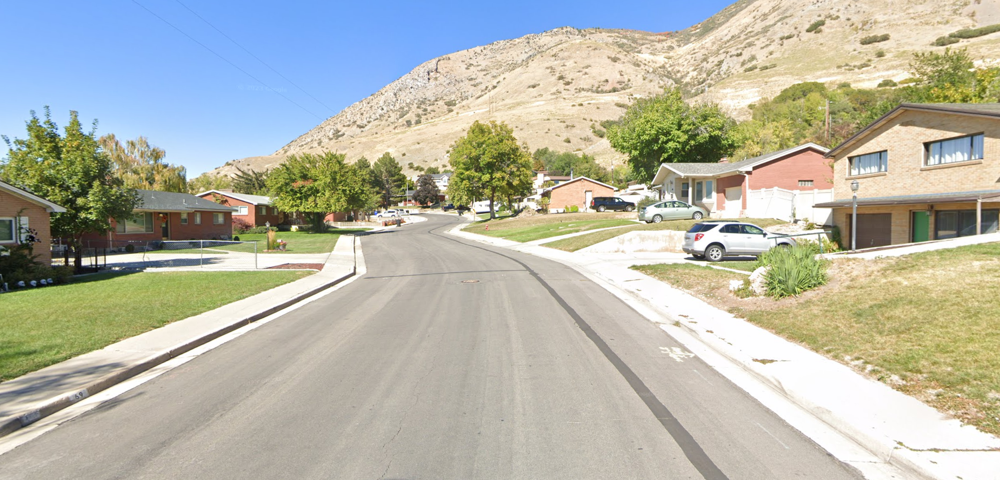
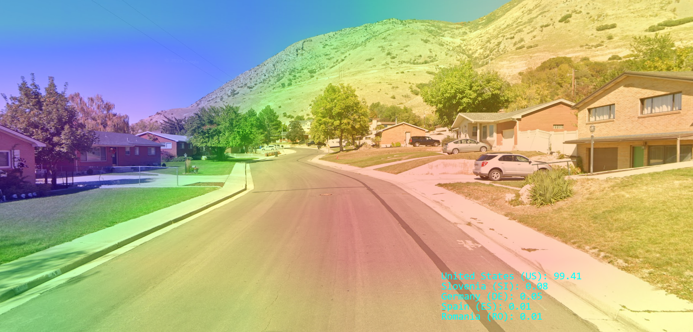
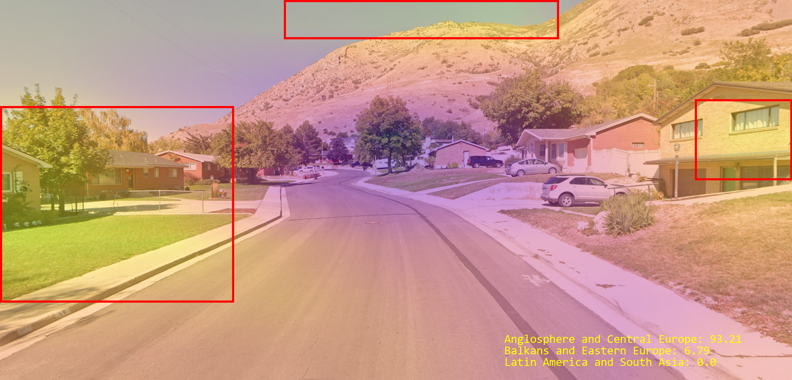

# Kopernik - geography-adjacent ResNet-based CNN by Google Street View data
## Introduction
**Kopernik** is an open-source machine learning project, focused on predicting geographic data based on landscape pictures inside or outside of urbanity.

### License
*Kopernik*
Copyright (C) *2026* *FLMxN*

This program is free software: you can redistribute it and/or modify
it under the terms of the GNU General Public License as published by
the Free Software Foundation, either version 3 of the License, or
(at your option) any later version.

This program is distributed in the hope that it will be useful,
but WITHOUT ANY WARRANTY; without even the implied warranty of
MERCHANTABILITY or FITNESS FOR A PARTICULAR PURPOSE.  See the
GNU General Public License for more details.

You should have received a copy of the GNU General Public License
along with this program.  If not, see <http://www.gnu.org/licenses/>.

### Architecture
Kopernik`s model architecture is based on Microsoft [Resnet-50](https://huggingface.co/microsoft/resnet-50) with pretrained weights of [IMAGENET-1K](https://huggingface.co/datasets/ILSVRC/imagenet-1k) in all occurences. Dataset used for training both [developer models](#model-setup) consists of <ins>**approximately 11.5k panorama images of 56 countries**</ins> (around 175 panoramas for each class). Dataset itself and additional information can be found on [Hugging Face](https://huggingface.co/datasets/stochastic/random_streetview_images_pano_v0.0.2)

**Credits**: [stochastic](https://huggingface.co/stochastic) (Winson Truong)

## Installation
### Dependencies
Kopernik mostly requires a standart package of machine learning and image processing libraries for Python >= 3.12 (including CUDA-supporting version of PyTorch and collateral) as well as CUDA-supporting GPU for training and/or inference.
```
pip install torch torchvision scikit-learn datasets numpy pillow tqdm pathlib dotenv
```
### Setup
In order to use pretrained fine-tuned models of the latest <ins>**developer version**</ins>, download it via [Hugging Face](https://huggingface.co/flmxn/resnet50-streetview)

Otherwise, to train Kopernik with your own configuration, look into [torch_trainer.py](torch_trainer.py) for country model and [torch_trainer_reg.py](torch_trainer_reg.py) for regional model respectfully.

Before start, make sure to confugire the paths to your models in [.env](.env) file and sample pictures in the inference config at [torch_main.py](torch_main.py)
```
CKPT = "E://resnet50_streetview_imagenet1k.pth" // country model
CKPT_REG = "E://resnet50_streetview_imagenet1k_regional.pth" // regional model
```
>.env
```
...
# ------------------------------------------------------------- CONFIG -------------------------------------------------------
...
IMGS = ["pics/us1.png"]
...
```
>torch_main.py

## Understanding predictions and labels
> [!NOTE]
> This section is constantly improving and getting new updates, based on tests and feedback.

> [!IMPORTANT]
> When working with a mathematical model, it is a common mistake to take it's predictions as-is. It is crucial to understand the meaning behind each label in a particular model architecture. [Developer models](#model-setup) is far from flawless, just as any other mathematical predictor of such nature.

To fairly estimate and interpret predictions of [this particular](#model-setup) model, let's categorize labels inside it's computing space.
+ <ins>**Null point attractors:**</ins> **New Zealand** (NZ), **Bhutan** (BT), **Eswatini** (SZ), **Cambodia** (KH) and **Argentina** (AR). These labels usually represent particular ambiguity of image features. Results, containing these labels as *top_k* are <ins>*unreliable*</ins> and serve no straightforward meaning due to lack of images' informative features.

> [!TIP]
> If you want to group <ins>**null point attractors**</ins> as **UNDEFINED** when listing predictions, check out [this](#startup)
  
+ <ins>**Common attractors:**</ins>
  - **Taiwan** (TW) and **South Korea** (KR) labels represent features of developed mostly Asian countries, although certain European or American landscapes can fit into this space as well. More often than not represents large urban centres of China, India, Japan, Australia, USA and Russia.
  - **Czech Republic** (CZ) label represents features of mostly post-soviet countries, although certain Eastern European landscapes can fit into this space as well. More often than not represents rural or small urban centres of Russia, Ukraine, Belarus, Poland, Estonia, Latvia and Lithuania.
  - **Greece** (GR) label represents features of mostly Balkan countries, although certain Eastern European landscapes can fit into this space as well. More often than not represents small urban centres of Russia, Ukraine, Belarus, Serbia, Hungary and Bulgaria.
  - **Finland** (FI) label represents features of mostly northern countries, although certain European landscapes can fit into this space as well. More often than not represents northern medium urban centres of Norway, Sweden, Finland, Denmark, Iceland and Russia. In particular cases, may represent features of large urban centres of East Asia. 
  - **Spain** (ES) label represents features of mostly European countries, although certain American landscapes can fit into this space as well. More often than not represents urban centres of France, Spain, Portugal and Italy.

+ <ins>**Particular attractors:**</ins>
  - **Botswana** (BW) label may represent features of rural or small urban centres of Japan.
  - **Mexico** (MX) label may represent features of rural or small urban centres of South America.
  - **Romania** (RO) label may represent features of highways or other kind of purely road images.
  - **Canada** (CA) label may represent features of neighbourhoods in USA.
  - **Sweden** (SE) label may represent features of townhouse settlements in North America or Oceania.
  - **Andorra** (AD) label may represent features of noisy or undefined landscapes in Latin American countries.
  - **Poland** (PL) label may represent features of southern recreational or resort locations.

## Inference
### Startup
If you completed [model setup](#model-setup) properly, inference requires no any additional preparations.
```
python torch_main.py
```
> [!TIP]
> Default output mode is pretty. In order to show debug logs and display more user-experience information, set **IS_PRETTY** in the inference config to <ins>*False*</ins> or pass additional argument when starting inference from shell:
> ```
> python torch_main.py verbose
> ``` 

### Pretty output digest
> [!TIP]
> Make sure to read [this](#understanding-predictions-and-labels) before getting into predictions provided below.


> 1260 East 50 North, Springville, UT 84663, USA
```
✅ Extracted model_state_dict from checkpoint
✅ Checkpoint loaded successfully (country)
✅ Extracted model_state_dict from checkpoint
✅ Checkpoint loaded successfully (regional)
```
Inference script successfully loaded and initialized both models: country and regional.
```
Particular predictions:
    United States (US): 99.41
    Estonia (EE): 0.25
    Slovenia (SI): 0.08
    Germany (DE): 0.05
    Chile (CL): 0.05
    Spain (ES): 0.01
    Romania (RO): 0.01
```

Country model is confident and determined enough to assume **United States of America** (US) as a definitive prediction. Gradient implies a **major** significance of <ins>**houses** and **trees** in the middle left of the image</ins>.
```
Regional predictions:
    Anglosphere and Central Europe: 93.21
    Balkans and Eastern Europe: 6.79
    Latin America and South Asia: 0.00
```

Regional model is confident and determined enough to assume **Anglosphere** as a definitive prediction. Gradient implies a **major significance** of a <ins>**house** in the middle left of the image</ins>, **mediocre** significance of a <ins>**house** in the middle right of the image</ins> and **mediocre** significance of a <ins>**hill valley** in the middle-left top of the image</ins>.
